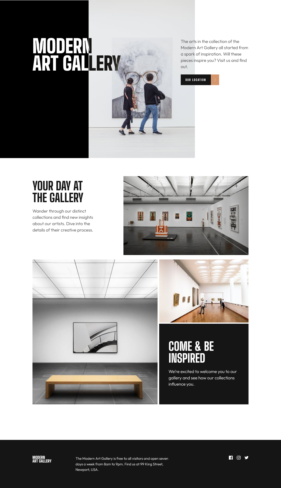

# Frontend Mentor - Art Gallery

This is a solution to the [Intro section with dropdown navigation challenge on Frontend Mentor](https://www.frontendmentor.io/challenges/art-gallery-website-yVdrZlxyA).

## Table of contents

- [Overview](#overview)
  - [The challenge](#the-challenge)
  - [Screenshot](#screenshot)
  - [Links](#links)
- [My process](#my-process)
  - [Built with](#built-with)

## Overview

### The challenge

Users should be able to:

### Screenshot

- Location page
  

### Links

- Solution URL: [code](https://github.com/waldekglaz/art-gallery-FEM)
- Live Site URL: [live](https://art-gallery-wg.netlify.app/)

## My process

### Built with

- React Js
- React Router
- Styled Components
- React Leaflet
- Mobile-first workflow

## Author

- Frontend Mentor - [@waldekglaz](https://www.frontendmentor.io/profile/waldekglaz)
